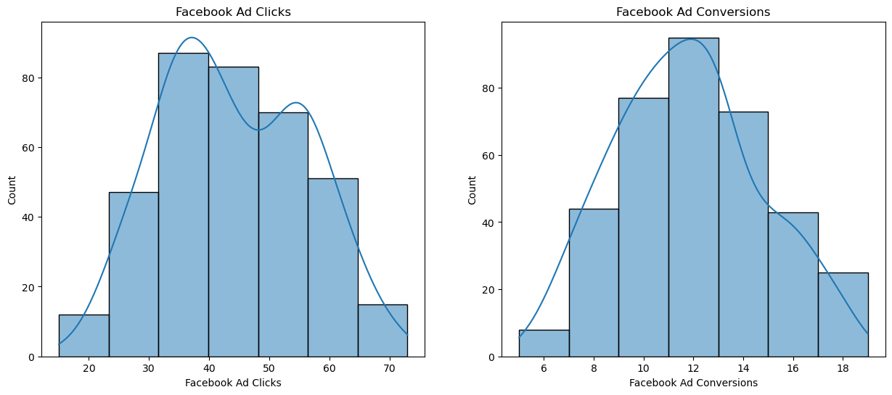
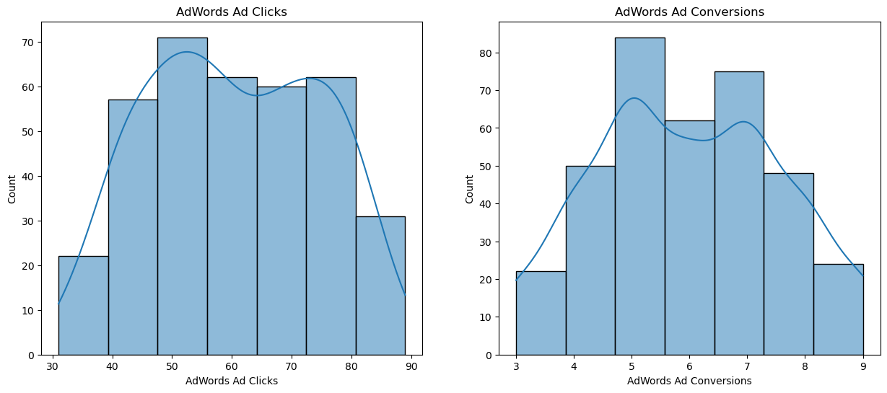
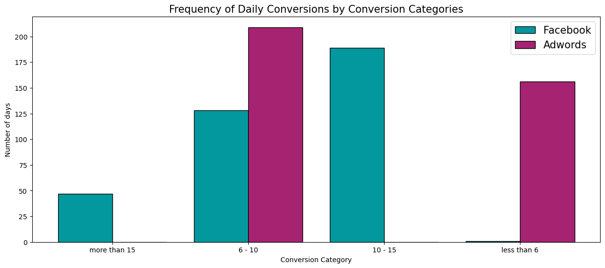
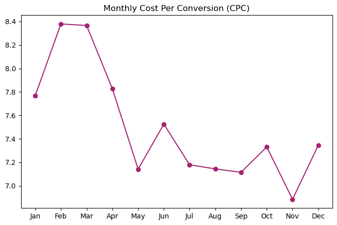

# A/B Testing & Regression Analysis in Marketing: Optimizing Ad Spend

## 📌 Project Overview
As a marketing agency, our primary objective is to maximize the Return on Investment (ROI) for our clients' advertising campaigns. This project analyzes the performance of two separate ad campaigns conducted throughout 2019: one on **Facebook** and the other on **Google AdWords**. 

The goal of this analysis is to determine which platform yields better results in terms of clicks, conversions, and overall cost-effectiveness. By identifying the most effective platform, we can allocate resources more efficiently and optimize advertising strategies to deliver better business outcomes.

## 🎯 Business Problem & Research Question
**Research Question:** *Which ad platform is more effective in terms of conversions, clicks, and overall cost-effectiveness?*

To answer this, we performed:
1. **Exploratory Data Analysis (EDA):** To understand the underlying trends in ad performance over the year.
2. **A/B Testing (Hypothesis Testing):** To statistically validate if the difference in performance metrics (CTR, Conversion Rate) between Facebook and AdWords is significant.
3. **Regression Analysis:** To model the relationship between advertising cost and conversions.
4. **Time Series Analysis:** To identify seasonal trends and patterns in campaign performance over time.

## 📊 Dataset
The dataset (`Marketing_Campaign_Data.csv`) contains 365 days of campaign data for the year 2019. 
Key features include:
* **Date:** January 1st, 2019, to December 31st, 2019.
* **Ad Views:** Number of times the ad was viewed.
* **Ad Clicks:** Number of clicks received on the ad.
* **Ad Conversions:** Number of conversions resulting from the ad.
* **Cost per Ad:** The cost associated with running the ad campaign.
* **Click-Through Rate (CTR):** The ratio of clicks to views.
* **Conversion Rate:** The ratio of conversions to clicks.
* **Cost per Click (CPC):** The average cost incurred per click.

## 🛠️ Tech Stack & Libraries Used
* **Python** (Data Manipulation & Analysis)
* **Pandas & NumPy** (Data processing and cleaning)
* **Matplotlib & Seaborn** (Data Visualization)
* **SciPy (`scipy.stats`)** (Statistical A/B Testing)
* **Scikit-Learn (`sklearn`)** (Linear Regression & Predictive Modeling)
* **Statsmodels** (Time Series Analysis & Seasonality)

## 🚀 Methodology
1. **Data Cleaning & Preprocessing:** Formatting dates, handling missing values, and ensuring data types are correct for analysis.
2. **Descriptive Statistics:** Comparing the average CTR, CVR, and CPC between the two platforms.
3. **Statistical Inference (A/B Testing):** Running t-tests to determine if the observed differences in campaign performance are statistically significant or due to random variance.
4. **Predictive Modeling:** Applying Linear Regression to forecast expected conversions based on specific budget allocations.
5. **Trend Analysis:** Decomposing time series data to observe if certain months or seasons yield higher marketing ROI.

## 📉 Data Visualizations
Here are some of the key visual insights generated from the analysis:






## 💡 Key Findings & Recommendations
* **Winner by Conversions:** **Facebook** significantly outperformed AdWords. The mean number of conversions per day on Facebook was **11.74**, compared to only **5.98** on AdWords (nearly double the conversions).
* **Click-to-Sale Correlation:** Facebook ads showed a strong positive linear relationship between clicks and sales (Correlation coefficient: **0.87**), compared to a moderate correlation for AdWords (0.45).
* **Statistical Significance (A/B Test):** The hypothesis test confirmed that the difference in conversions between Facebook and AdWords is highly statistically significant (T-statistic: 32.88, p-value: 9.35e-134).
* **Predictive Modeling:** A Linear Regression model predicting Facebook ad conversions based on clicks achieved an R-squared score of **76.35%**, demonstrating good predictive power for setting realistic campaign goals.
* **Timing & Cost Trends:** Mondays and Tuesdays exhibited the highest conversion rates. Additionally, May and November showed the lowest Cost Per Conversion (CPC).
* **Business Recommendation:** Given the significant difference in conversion rates and strong ROI, we recommend reallocating resources towards **Facebook advertising efforts**. Furthermore, campaigns should be optimized to target early-week engagement and capitalize on low CPC months like May and November.

## 📂 Project Structure
```text
├── data/
│   └── Marketing_Campaign_Data.csv  # The dataset used for analysis
├── notebook.ipynb                   # Jupyter Notebook with full analysis and code
└── README.md                        # Project documentation
```

## 🏃‍♂️ How to Run
1. Clone this repository.
2. Ensure you have the required libraries installed (`pip install pandas numpy matplotlib seaborn scipy scikit-learn statsmodels`).
3. Open `notebook.ipynb` in Jupyter Notebook or Google Colab and run the cells sequentially.
